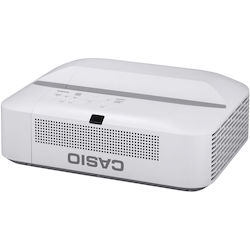

ofxCasioProjectorControl
===

A openFrameworks addon for Casio Projectors.

If you would like to contribute to the addon feel free to fork, hack and modify the code. Also drop me a line and let me know how you end up using the addon.

[@david_haylock](https://twitter.com/david_haylock)

####Requirements

openFrameworks v0.9.0

####What the addon includes

ofxCasioProjectorControl src

Simple example which allows you to use the basic functionality of the addon